👋 Hello, I'm Benjamin! I mainly spend my time making games in GameMaker. I also somehow became a web developer by complete accident...

My other hobby includes spending hours automating tasks (usually in Python) that only take 5 minutes.

<a href="https://github.com/BenjaminHalko">
	<picture>
	<source
		srcset="https://github-readme-stats.vercel.app/api?username=benjaminhalko&show_icons=true&theme=github_light&hide_border=true&bg_color=00000000"
		media="(prefers-color-scheme: light), (prefers-color-scheme: no-preference)"
	/>
	
	</picture>
</a>

	
	
	
	
	<a href="https://github.com/BenjaminHalko">
	
	

<h1 align="center">Profile Games</h1>
<!-- CONNECT4 -->

<h2>Connect 4</h2>

<table align="center">
<tr></tr>
<tr><td>

<b>A game of Connect 4 played on GitHub.</b> 🔴 Click on a column to make a move. It is currently Red's turn. 🔴

| [COL 0](https://github.com/BenjaminHalko/BenjaminHalko/issues/new?title=Connect4:+0&body=Please+do+not+change+the+title.+Just+click+"Submit+new+issue".+You+do+not+need+to+do+anything+else.+%3AD) | [COL 1](https://github.com/BenjaminHalko/BenjaminHalko/issues/new?title=Connect4:+1&body=Please+do+not+change+the+title.+Just+click+"Submit+new+issue".+You+do+not+need+to+do+anything+else.+%3AD) | [COL 2](https://github.com/BenjaminHalko/BenjaminHalko/issues/new?title=Connect4:+2&body=Please+do+not+change+the+title.+Just+click+"Submit+new+issue".+You+do+not+need+to+do+anything+else.+%3AD) | [COL 3](https://github.com/BenjaminHalko/BenjaminHalko/issues/new?title=Connect4:+3&body=Please+do+not+change+the+title.+Just+click+"Submit+new+issue".+You+do+not+need+to+do+anything+else.+%3AD) | [COL 4](https://github.com/BenjaminHalko/BenjaminHalko/issues/new?title=Connect4:+4&body=Please+do+not+change+the+title.+Just+click+"Submit+new+issue".+You+do+not+need+to+do+anything+else.+%3AD) | [COL 5](https://github.com/BenjaminHalko/BenjaminHalko/issues/new?title=Connect4:+5&body=Please+do+not+change+the+title.+Just+click+"Submit+new+issue".+You+do+not+need+to+do+anything+else.+%3AD) | [COL 6](https://github.com/BenjaminHalko/BenjaminHalko/issues/new?title=Connect4:+6&body=Please+do+not+change+the+title.+Just+click+"Submit+new+issue".+You+do+not+need+to+do+anything+else.+%3AD) | [COL 7](https://github.com/BenjaminHalko/BenjaminHalko/issues/new?title=Connect4:+7&body=Please+do+not+change+the+title.+Just+click+"Submit+new+issue".+You+do+not+need+to+do+anything+else.+%3AD) |
| :-: | :-: | :-: | :-: | :-: | :-: | :-: | :-: |
|  |  |  |  |  |  |  |  |
|  |  |  |  |  |  |  |  |
|  |  |  |  |  |  |  |  |
|  |  |  |  |  |  |  |  |
|  |  |  |  |  |  |  |  |
|  |  |  |  |  |  |  |  |

<h3>History of moves for this game</h3>

| Move | User |
| :-: | :-: |
| 🟡 Column 4 | [ @BenjaminHalko](https://github.com/BenjaminHalko) |
| 🔴 Column 5 | [ @BenjaminHalko](https://github.com/BenjaminHalko) |
| 🟡 Column 1 | [ @BenjaminHalko](https://github.com/BenjaminHalko) |
| 🔴 Column 2 | [ @BenjaminHalko](https://github.com/BenjaminHalko) |
| 🟡 Column 4 | [ @BenjaminHalko](https://github.com/BenjaminHalko) |
| 🔴 Column 2 | [ @BenjaminHalko](https://github.com/BenjaminHalko) |
| 🟡 Column 6 | [ @BenjaminHalko](https://github.com/BenjaminHalko) |
| 🔴 Column 5 | [ @BenjaminHalko](https://github.com/BenjaminHalko) |
| 🟡 Column 2 | [ @BenjaminHalko](https://github.com/BenjaminHalko) |
| 🔴 Column 4 | [ @BenjaminHalko](https://github.com/BenjaminHalko) |
| 🟡 Column 3 | [ @BenjaminHalko](https://github.com/BenjaminHalko) |
| 🔴 Column 3 | [ @BenjaminHalko](https://github.com/BenjaminHalko) |

<h3>Top 10 most active players</h3>

| Moves | User |
| :-: | :-: |
| 24 | [ @BenjaminHalko](https://github.com/BenjaminHalko) |

<h3>Stats</h3>

| Stat | Value |
| :-: | :-: |
| Red Wins | 1 |
| Yellow Wins | 0 |
| Average Time per Game | 2 Hours, 53 Minutes, 50 Seconds |
| Average Moves per Game | 11.0 |

</td></tr>
</table>

<!-- CONNECT4 -->
<!-- OTHELLO -->

<h2>Othello</h2>

<table align="center">
<tr></tr>
<tr><td>

<b>A game of Othello played on GitHub.</b> Click on a white dot to make your move. Blue has 4 pieces. Green has 12 pieces. 🔵 It is currently Blue's turn. 🔵

|  | A | B | C | D | E | F | G | H |
| :-: | :-: | :-: | :-: | :-: | :-: | :-: | :-: | :-: |
| 0 |  |  |  |  |  |  |  |  |
| 1 |  |  |  |  |  |  |  |  |
| 2 |  |  |  |  |  |  |  |  |
| 3 |  |  |  |  |  |  |  |  |
| 4 |  |  |  |  |  |  |  |  |
| 5 |  |  |  |  |  |  |  |  |
| 6 |  |  |  |  |  |  |  |  |
| 7 |  |  |  |  |  |  |  |  |

<h3>History of moves for this game</h3>

| Move | User |
| :-: | :-: |
| 🟢 D1 | [ @BenjaminHalko](https://github.com/BenjaminHalko) |
| 🔵 B5 | [ @BenjaminHalko](https://github.com/BenjaminHalko) |
| 🟢 E6 | [ @BenjaminHalko](https://github.com/BenjaminHalko) |
| 🔵 D2 | [ @BenjaminHalko](https://github.com/BenjaminHalko) |
| 🟢 E2 | [ @BenjaminHalko](https://github.com/BenjaminHalko) |
| 🔵 C6 | [ @BenjaminHalko](https://github.com/BenjaminHalko) |
| 🟢 C3 | [ @BenjaminHalko](https://github.com/BenjaminHalko) |
| 🔵 F3 | [ @BenjaminHalko](https://github.com/BenjaminHalko) |
| 🟢 E5 | [ @BenjaminHalko](https://github.com/BenjaminHalko) |
| 🔵 D5 | [ @BenjaminHalko](https://github.com/BenjaminHalko) |
| 🟢 C5 | [ @BenjaminHalko](https://github.com/BenjaminHalko) |
| 🔵 C4 | [ @BenjaminHalko](https://github.com/BenjaminHalko) |

<h3>Top 10 most active players</h3>

| Moves | User |
| :-: | :-: |
| 12 | [ @BenjaminHalko](https://github.com/BenjaminHalko) |

<h3>Stats</h3>

| Stat | Value |
| :-: | :-: |
| Blue Wins | 0 |
| Green Wins | 0 |

</td></tr>
</table>

<!-- OTHELLO -->
<h1 align="center" style="vertical-align: top">GitHub Stats</h1>

<a href="https://github.com/BenjaminHalko">
	<picture>
		<source 
			srcset="header.svg"
			media="(min-width: 800px)"
			width="49%"
			alt="header"
  		/>
		
		 
	</picture>
</a>

<a href="https://github.com/BenjaminHalko">
	<picture>
		<source 
			srcset="languages.svg"
			media="(min-width: 800px)"
			width="49%"
  		/>
		
		 
	</picture>
</a>

<a href="https://github.com/BenjaminHalko?tab=repositories">
	<picture>
		<source 
			srcset="repositories.svg"
			media="(min-width: 800px)"
			width="49%"
			alt="repositories"
  		/>
		
		 
	</picture>
</a>

<a href="https://github.com/BenjaminHalko">
	<picture>
		<source 
			srcset="activity_community.svg"
			media="(min-width: 800px)"
			width="49%"
			alt="activity & community"
  		/>
		
		 
	</picture>
</a>

<a href="https://github.com/BenjaminHalko">
	<picture>
		<source 
			srcset="iso_calendar.svg"
			media="(min-width: 800px)"
			width="49%"
			alt="iso calendar"
  		/>
		
		 
	</picture>
</a>

<a href="https://github.com/BenjaminHalko">
	<picture>
		<source 
			srcset="habits.svg"
			media="(min-width: 800px)"
			width="49%"
			alt="habits"
  		/>
		
		 
	</picture>
</a>

<a href="https://wakatime.com/@benjaminhalko">
	<picture>
	<source
		srcset="https://github-readme-stats.vercel.app/api/wakatime?username=benjaminhalko&show_icons=true&theme=github_dark&hide_border=true&layout=compact&bg_color=00000000"
		media="(prefers-color-scheme: dark) and (min-width: 800)"
		width="49%"
		alt="wakatime stats"
	/>
	
	</picture>
</a>

<a href="https://github.com/BenjaminHalko">
	<picture>
		<source 
			srcset="achievements.svg"
			media="(min-width: 800px)"
			width="49%"
			alt="achievements"
  		/>
		
		 
	</picture
</a>

