<h2 align="center">👋 Hello, I'm Benjamin!</h2>

	
	
	
	<a href="https://github.com/BenjaminHalko">
	
	

<table align="center">
<tr>
	<td>
		I mainly spend my time <a href="https://benjamin-halko.itch.io">making games</a> in GameMaker, though I also <a href="https://github.com/BenjaminHalko/Cho-RealEstate-Website">design websites</a> in Node.js and <a href="https://github.com/BenjaminHalko/WiiMusicEditorPlus">create tools</a> in Python.
	</td>
</tr>
<tr>
	<td>
		🌱 I am currently attempting to become a game programmer at <a href="https://lasallecollegevancouver.com/vfx-game-design/game-programming-bachelor">LaSalle College</a>.
	</td>
</tr>
<tr>
	<td>
		💬 My area of expertise includes <b>GameMaker</b>, <b>Python</b>, <b>HTML</b>, <b>CSS</b>, <b>JavaScript</b>, <b>PowerShell</b>, and <b>C++</b>.
	</td>
</tr>
</table>

<a href="https://github.com/BenjaminHalko">
	<picture>
	<source
		srcset="https://github-readme-stats.vercel.app/api?username=benjaminhalko&show_icons=true&theme=github_light&hide_border=true&bg_color=00000000"
		media="(prefers-color-scheme: light)"
	/>
	
	</picture>
</a>
<a href="https://github.com/BenjaminHalko">
	<picture>
	<source
		srcset="https://github-readme-stats.vercel.app/api/top-langs?username=benjaminhalko&show_icons=true&theme=github_light&hide_border=true&bg_color=00000000&layout=compact&langs_count=8&hide=yacc&card_width=340px"
		media="(prefers-color-scheme: light)"
	/>
	
	</picture>
</a>

<h1 align="center">Profile Games</h1>
<!-- CONNECT4 -->

<h2>Connect 4</h2>

<table align="center">
<tr></tr>
<tr><td>

<b>A game of Connect 4 played on GitHub.</b> 🔴 Click on a column to make a move. It is currently Red's turn. 🔴

| [COL 0](https://github.com/BenjaminHalko/BenjaminHalko/issues/new?title=Connect4:+0&body=Please+do+not+change+the+title.+Just+click+"Submit+new+issue".+You+do+not+need+to+do+anything+else.+%3AD) | [COL 1](https://github.com/BenjaminHalko/BenjaminHalko/issues/new?title=Connect4:+1&body=Please+do+not+change+the+title.+Just+click+"Submit+new+issue".+You+do+not+need+to+do+anything+else.+%3AD) | [COL 2](https://github.com/BenjaminHalko/BenjaminHalko/issues/new?title=Connect4:+2&body=Please+do+not+change+the+title.+Just+click+"Submit+new+issue".+You+do+not+need+to+do+anything+else.+%3AD) | [COL 3](https://github.com/BenjaminHalko/BenjaminHalko/issues/new?title=Connect4:+3&body=Please+do+not+change+the+title.+Just+click+"Submit+new+issue".+You+do+not+need+to+do+anything+else.+%3AD) | [COL 4](https://github.com/BenjaminHalko/BenjaminHalko/issues/new?title=Connect4:+4&body=Please+do+not+change+the+title.+Just+click+"Submit+new+issue".+You+do+not+need+to+do+anything+else.+%3AD) | [COL 5](https://github.com/BenjaminHalko/BenjaminHalko/issues/new?title=Connect4:+5&body=Please+do+not+change+the+title.+Just+click+"Submit+new+issue".+You+do+not+need+to+do+anything+else.+%3AD) | [COL 6](https://github.com/BenjaminHalko/BenjaminHalko/issues/new?title=Connect4:+6&body=Please+do+not+change+the+title.+Just+click+"Submit+new+issue".+You+do+not+need+to+do+anything+else.+%3AD) | [COL 7](https://github.com/BenjaminHalko/BenjaminHalko/issues/new?title=Connect4:+7&body=Please+do+not+change+the+title.+Just+click+"Submit+new+issue".+You+do+not+need+to+do+anything+else.+%3AD) |
| :-: | :-: | :-: | :-: | :-: | :-: | :-: | :-: |
|  |  |  |  |  |  |  |  |
|  |  |  |  |  |  |  |  |
|  |  |  |  |  |  |  |  |
|  |  |  |  |  |  |  |  |
|  |  |  |  |  |  |  |  |
|  |  |  |  |  |  |  |  |

<h3>History of moves for this game</h3>

| Move | User |
| :-: | :-: |
| 🟡 Column 3 | [ @BreadGhoti1](https://github.com/BreadGhoti1) |
| 🔴 Column 3 | [ @cbebe](https://github.com/cbebe) |
| 🟡 Column 3 | [ @alinarub](https://github.com/alinarub) |
| 🔴 Column 2 | [ @neealdon3](https://github.com/neealdon3) |
| 🟡 Column 4 | [ @oSumAtrIX](https://github.com/oSumAtrIX) |
| 🔴 Column 4 | [ @BenjaminHalko](https://github.com/BenjaminHalko) |
| 🟡 Column 3 | [ @BenjaminHalko](https://github.com/BenjaminHalko) |
| 🔴 Column 4 | [ @BenjaminHalko](https://github.com/BenjaminHalko) |

<h3>Top 10 most active players</h3>

| Moves | User |
| :-: | :-: |
| 29 | [ @BenjaminHalko](https://github.com/BenjaminHalko) |
| 1 | [ @lluminate](https://github.com/lluminate) |
| 1 | [ @PHANTOMGOD2OP](https://github.com/PHANTOMGOD2OP) |
| 1 | [ @oSumAtrIX](https://github.com/oSumAtrIX) |
| 1 | [ @neealdon3](https://github.com/neealdon3) |
| 1 | [ @alinarub](https://github.com/alinarub) |
| 1 | [ @cbebe](https://github.com/cbebe) |
| 1 | [ @BreadGhoti1](https://github.com/BreadGhoti1) |

<h3>Stats</h3>

| Stat | Value |
| :-: | :-: |
| Red Wins | 1 |
| Yellow Wins | 1 |
| Average Time per Game | 6 Days, 9 Hours, 47 Minutes, 56 Seconds |
| Average Moves per Game | 13.5 |

</td></tr>
</table>

<!-- CONNECT4 -->
<!-- OTHELLO -->

<h2>Othello</h2>

<table align="center">
<tr></tr>
<tr><td>

<b>A game of Othello played on GitHub.</b> Click on a white dot to make your move. Blue has 11 pieces. Green has 11 pieces. 🔵 It is currently Blue's turn. 🔵

|  | A | B | C | D | E | F | G | H |
| :-: | :-: | :-: | :-: | :-: | :-: | :-: | :-: | :-: |
| 0 |  |  |  |  |  |  |  |  |
| 1 |  |  |  |  |  |  |  |  |
| 2 |  |  |  |  |  |  |  |  |
| 3 |  |  |  |  |  |  |  |  |
| 4 |  |  |  |  |  |  |  |  |
| 5 |  |  |  |  |  |  |  |  |
| 6 |  |  |  |  |  |  |  |  |
| 7 |  |  |  |  |  |  |  |  |

<h3>History of moves for this game</h3>

| Move | User |
| :-: | :-: |
| 🟢 B3 | [ @Denchyaknow](https://github.com/Denchyaknow) |
| 🔵 A7 | [ @dleedev](https://github.com/dleedev) |
| 🟢 G6 | [ @BenjaminHalko](https://github.com/BenjaminHalko) |
| 🔵 E1 | [ @BenjaminHalko](https://github.com/BenjaminHalko) |
| 🟢 B6 | [ @BenjaminHalko](https://github.com/BenjaminHalko) |
| 🔵 F5 | [ @BenjaminHalko](https://github.com/BenjaminHalko) |
| 🟢 D1 | [ @BenjaminHalko](https://github.com/BenjaminHalko) |
| 🔵 B5 | [ @BenjaminHalko](https://github.com/BenjaminHalko) |
| 🟢 E6 | [ @BenjaminHalko](https://github.com/BenjaminHalko) |
| 🔵 D2 | [ @BenjaminHalko](https://github.com/BenjaminHalko) |
| 🟢 E2 | [ @BenjaminHalko](https://github.com/BenjaminHalko) |
| 🔵 C6 | [ @BenjaminHalko](https://github.com/BenjaminHalko) |
| 🟢 C3 | [ @BenjaminHalko](https://github.com/BenjaminHalko) |
| 🔵 F3 | [ @BenjaminHalko](https://github.com/BenjaminHalko) |
| 🟢 E5 | [ @BenjaminHalko](https://github.com/BenjaminHalko) |
| 🔵 D5 | [ @BenjaminHalko](https://github.com/BenjaminHalko) |
| 🟢 C5 | [ @BenjaminHalko](https://github.com/BenjaminHalko) |
| 🔵 C4 | [ @BenjaminHalko](https://github.com/BenjaminHalko) |

<h3>Top 10 most active players</h3>

| Moves | User |
| :-: | :-: |
| 16 | [ @BenjaminHalko](https://github.com/BenjaminHalko) |
| 1 | [ @dleedev](https://github.com/dleedev) |
| 1 | [ @Denchyaknow](https://github.com/Denchyaknow) |

<h3>Stats</h3>

| Stat | Value |
| :-: | :-: |
| Blue Wins | 0 |
| Green Wins | 0 |

</td></tr>
</table>

<!-- OTHELLO -->
<h1 align="center">More Stats!</h1>

<a href="https://wakatime.com/@benjaminhalko">
	<picture>
	<source
		srcset="https://github-readme-stats.vercel.app/api/wakatime?username=benjaminhalko&show_icons=true&theme=github_light&hide_border=true&layout=compact&bg_color=00000000&langs_count=18&hide=leetcode,other,text"
		media="(prefers-color-scheme: light)"
		alt="wakatime stats"
		width="412px"
	/>
	
	</picture>
</a>

