<h2 align="center">👋 Hello, I'm Benjamin!</h2>

	
	
	
	<a href="https://github.com/BenjaminHalko">
	
	
	

<table align="center">
<tr>
	<td>
		 I am currently a software engineer at <a href="https://lottiefiles.com">LottieFiles</a>.
	</td>
</tr>
<tr>
	<td>
		 I made <a href="https://store.steampowered.com/app/2944340/Unless/">Unless</a>, a short platformer about collecting leaves and speed running.
	</td>
</tr>
<tr>
	<td>
		🎮 In my free time, I make <a href="https://benjamin-halko.itch.io">even more games</a> in GameMaker, contribute to the <a href="https://github.com/ReVanced/revanced-manager">ReVanced Manager</a>, and <a href="https://github.com/BenjaminHalko/WiiMusicEditorPlus">create tools</a> in Python.
	</td>
</tr>
<tr>
	<td>
		🌱 I am currently attempting to become a game programmer at <a href="https://lasallecollegevancouver.lcieducation.com/en/programs-and-courses/bachelor-science-in-game-programming/details">LaSalle College</a>.
	</td>
</tr>
<tr>
	<td>
		⭐ My area of expertise includes <b>GameMaker</b>, <b>C++</b>, <b>Python</b>, and <b>Rust</b>.
	</td>
</tr>
<tr>
	<td>
		💬 If you want to chat, feel free to message me on <a href="https://discord.com/users/752353849070714980">Discord</a></b>.
	</td>
</tr>
</table>

<a href="https://github.com/BenjaminHalko">
	<picture>
	<source
		srcset="https://github-stats-benjamin-halko.vercel.app/api?username=benjaminhalko&show_icons=true&theme=github_light&hide_border=true&bg_color=00000000"
		media="(prefers-color-scheme: light)"
	/>
	
	</picture>
</a>
<a href="https://github.com/BenjaminHalko">
	<picture>
	<source
		srcset="https://github-stats-benjamin-halko.vercel.app/api/top-langs?username=benjaminhalko&show_icons=true&theme=github_light&hide_border=true&bg_color=00000000&layout=compact&langs_count=8&hide=yacc&card_width=340px"
		media="(prefers-color-scheme: light)"
	/>
	
	</picture>
</a>

<h1 align="center">Profile Games</h1>
<!-- CONNECT4 -->

<h2>Connect 4</h2>

<table align="center">
<tr></tr>
<tr><td>

<b>A game of Connect 4 played on GitHub.</b> 🟡 Click on a column to make a move. It is currently Yellow's turn. 🟡

| [COL 0](https://github.com/BenjaminHalko/BenjaminHalko/issues/new?title=Connect4:+0&body=Please+do+not+change+the+title.+Just+click+"Submit+new+issue".+You+do+not+need+to+do+anything+else.+%3AD) | [COL 1](https://github.com/BenjaminHalko/BenjaminHalko/issues/new?title=Connect4:+1&body=Please+do+not+change+the+title.+Just+click+"Submit+new+issue".+You+do+not+need+to+do+anything+else.+%3AD) | [COL 2](https://github.com/BenjaminHalko/BenjaminHalko/issues/new?title=Connect4:+2&body=Please+do+not+change+the+title.+Just+click+"Submit+new+issue".+You+do+not+need+to+do+anything+else.+%3AD) | [COL 3](https://github.com/BenjaminHalko/BenjaminHalko/issues/new?title=Connect4:+3&body=Please+do+not+change+the+title.+Just+click+"Submit+new+issue".+You+do+not+need+to+do+anything+else.+%3AD) | [COL 4](https://github.com/BenjaminHalko/BenjaminHalko/issues/new?title=Connect4:+4&body=Please+do+not+change+the+title.+Just+click+"Submit+new+issue".+You+do+not+need+to+do+anything+else.+%3AD) | [COL 5](https://github.com/BenjaminHalko/BenjaminHalko/issues/new?title=Connect4:+5&body=Please+do+not+change+the+title.+Just+click+"Submit+new+issue".+You+do+not+need+to+do+anything+else.+%3AD) | [COL 6](https://github.com/BenjaminHalko/BenjaminHalko/issues/new?title=Connect4:+6&body=Please+do+not+change+the+title.+Just+click+"Submit+new+issue".+You+do+not+need+to+do+anything+else.+%3AD) | [COL 7](https://github.com/BenjaminHalko/BenjaminHalko/issues/new?title=Connect4:+7&body=Please+do+not+change+the+title.+Just+click+"Submit+new+issue".+You+do+not+need+to+do+anything+else.+%3AD) |
| :-: | :-: | :-: | :-: | :-: | :-: | :-: | :-: |
|  |  |  |  |  |  |  |  |
|  |  |  |  |  |  |  |  |
|  |  |  |  |  |  |  |  |
|  |  |  |  |  |  |  |  |
|  |  |  |  |  |  |  |  |
|  |  |  |  |  |  |  |  |

<h3>History of moves for this game</h3>

| Move | User |
| :-: | :-: |
| 🔴 Column 0 | [ @BenjaminHalko](https://github.com/BenjaminHalko) |
| 🟡 Column 1 | [ @BenjaminHalko](https://github.com/BenjaminHalko) |
| 🔴 Column 6 | [ @joelbaldapan](https://github.com/joelbaldapan) |
| 🟡 Column 1 | [ @IbrahimExe](https://github.com/IbrahimExe) |
| 🔴 Column 5 | [ @SpacEagle17](https://github.com/SpacEagle17) |
| 🟡 Column 5 | [ @IgorPiFe](https://github.com/IgorPiFe) |
| 🔴 Column 3 | [ @owen-the-kid](https://github.com/owen-the-kid) |
| 🟡 Column 2 | [ @lluminate](https://github.com/lluminate) |
| 🔴 Column 1 | [ @BenjaminHalko](https://github.com/BenjaminHalko) |
| 🟡 Column 2 | [ @owen-the-kid](https://github.com/owen-the-kid) |
| 🔴 Column 5 | [ @cbebe](https://github.com/cbebe) |
| 🟡 Column 4 | [ @Felitendo](https://github.com/Felitendo) |
| 🔴 Column 5 | [ @Felitendo](https://github.com/Felitendo) |
| 🟡 Column 6 | [ @ASHVALDE](https://github.com/ASHVALDE) |
| 🔴 Column 2 | [ @2noScript](https://github.com/2noScript) |
| 🟡 Column 3 | [ @BreadGhoti1](https://github.com/BreadGhoti1) |
| 🔴 Column 3 | [ @cbebe](https://github.com/cbebe) |
| 🟡 Column 3 | [ @alinarub](https://github.com/alinarub) |
| 🔴 Column 2 | [ @neealdon3](https://github.com/neealdon3) |
| 🟡 Column 4 | [ @oSumAtrIX](https://github.com/oSumAtrIX) |
| 🔴 Column 4 | [ @BenjaminHalko](https://github.com/BenjaminHalko) |
| 🟡 Column 3 | [ @BenjaminHalko](https://github.com/BenjaminHalko) |
| 🔴 Column 4 | [ @BenjaminHalko](https://github.com/BenjaminHalko) |

<h3>Most active players</h3>

| Moves | User |
| :-: | :-: |
| 32 | [ @BenjaminHalko](https://github.com/BenjaminHalko) |
| 2 | [ @lluminate](https://github.com/lluminate) |
| 2 | [ @cbebe](https://github.com/cbebe) |
| 2 | [ @Felitendo](https://github.com/Felitendo) |
| 2 | [ @owen-the-kid](https://github.com/owen-the-kid) |
| 1 | [ @PHANTOMGOD2OP](https://github.com/PHANTOMGOD2OP) |
| 1 | [ @oSumAtrIX](https://github.com/oSumAtrIX) |
| 1 | [ @neealdon3](https://github.com/neealdon3) |
| 1 | [ @alinarub](https://github.com/alinarub) |
| 1 | [ @BreadGhoti1](https://github.com/BreadGhoti1) |
| 1 | [ @2noScript](https://github.com/2noScript) |
| 1 | [ @ASHVALDE](https://github.com/ASHVALDE) |
| 1 | [ @IgorPiFe](https://github.com/IgorPiFe) |
| 1 | [ @SpacEagle17](https://github.com/SpacEagle17) |
| 1 | [ @IbrahimExe](https://github.com/IbrahimExe) |
| 1 | [ @joelbaldapan](https://github.com/joelbaldapan) |

<h3>Stats</h3>

| Stat | Value |
| :-: | :-: |
| Red Wins | 1 |
| Yellow Wins | 1 |
| Average Time per Game | 6 Days, 9 Hours, 47 Minutes, 56 Seconds |
| Average Moves per Game | 13.5 |

</td></tr>
</table>

<!-- CONNECT4 -->
<!-- OTHELLO -->

<h2>Othello</h2>

<table align="center">
<tr></tr>
<tr><td>

<b>A game of Othello played on GitHub.</b> Click on a white dot to make your move. Blue has 13 pieces. Green has 14 pieces. 🟢 It is currently Green's turn. 🟢

|  | A | B | C | D | E | F | G | H |
| :-: | :-: | :-: | :-: | :-: | :-: | :-: | :-: | :-: |
| 0 |  |  |  |  |  |  |  |  |
| 1 |  |  |  |  |  |  |  |  |
| 2 |  |  |  |  |  |  |  |  |
| 3 |  |  |  |  |  |  |  |  |
| 4 |  |  |  |  |  |  |  |  |
| 5 |  |  |  |  |  |  |  |  |
| 6 |  |  |  |  |  |  |  |  |
| 7 |  |  |  |  |  |  |  |  |

<h3>History of moves for this game</h3>

| Move | User |
| :-: | :-: |
| 🔵 C2 | [ @DSDHX](https://github.com/DSDHX) |
| 🟢 E7 | [ @DSDHX](https://github.com/DSDHX) |
| 🔵 F7 | [ @DSDHX](https://github.com/DSDHX) |
| 🟢 A6 | [ @Coding4Hours](https://github.com/Coding4Hours) |
| 🔵 D6 | [ @Coding4Hours](https://github.com/Coding4Hours) |
| 🟢 B3 | [ @Denchyaknow](https://github.com/Denchyaknow) |
| 🔵 A7 | [ @dleedev](https://github.com/dleedev) |
| 🟢 G6 | [ @BenjaminHalko](https://github.com/BenjaminHalko) |
| 🔵 E1 | [ @BenjaminHalko](https://github.com/BenjaminHalko) |
| 🟢 B6 | [ @BenjaminHalko](https://github.com/BenjaminHalko) |
| 🔵 F5 | [ @BenjaminHalko](https://github.com/BenjaminHalko) |
| 🟢 D1 | [ @BenjaminHalko](https://github.com/BenjaminHalko) |
| 🔵 B5 | [ @BenjaminHalko](https://github.com/BenjaminHalko) |
| 🟢 E6 | [ @BenjaminHalko](https://github.com/BenjaminHalko) |
| 🔵 D2 | [ @BenjaminHalko](https://github.com/BenjaminHalko) |
| 🟢 E2 | [ @BenjaminHalko](https://github.com/BenjaminHalko) |
| 🔵 C6 | [ @BenjaminHalko](https://github.com/BenjaminHalko) |
| 🟢 C3 | [ @BenjaminHalko](https://github.com/BenjaminHalko) |
| 🔵 F3 | [ @BenjaminHalko](https://github.com/BenjaminHalko) |
| 🟢 E5 | [ @BenjaminHalko](https://github.com/BenjaminHalko) |
| 🔵 D5 | [ @BenjaminHalko](https://github.com/BenjaminHalko) |
| 🟢 C5 | [ @BenjaminHalko](https://github.com/BenjaminHalko) |
| 🔵 C4 | [ @BenjaminHalko](https://github.com/BenjaminHalko) |

<h3>Most active players</h3>

| Moves | User |
| :-: | :-: |
| 16 | [ @BenjaminHalko](https://github.com/BenjaminHalko) |
| 3 | [ @DSDHX](https://github.com/DSDHX) |
| 2 | [ @Coding4Hours](https://github.com/Coding4Hours) |
| 1 | [ @dleedev](https://github.com/dleedev) |
| 1 | [ @Denchyaknow](https://github.com/Denchyaknow) |

<h3>Stats</h3>

| Stat | Value |
| :-: | :-: |
| Blue Wins | 0 |
| Green Wins | 0 |

</td></tr>
</table>

<!-- OTHELLO -->
<h1 align="center">More Stats!</h1>

<a href="https://wakatime.com/@benjaminhalko">
	<picture>
	<source
		srcset="https://github-readme-stats.vercel.app/api/wakatime?username=benjaminhalko&show_icons=true&theme=github_light&hide_border=true&layout=compact&bg_color=00000000&langs_count=18&hide=leetcode,other,text"
		media="(prefers-color-scheme: light)"
		alt="wakatime stats"
		width="412px"
	/>
	
	</picture>
</a>

